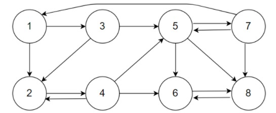
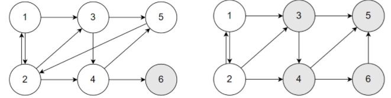
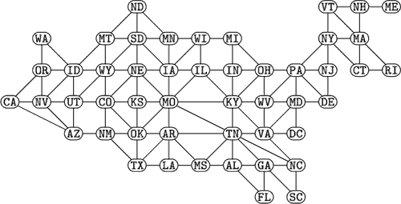

#Linear Algebra: PageRank
Fundação Getúlio Vargas - Escola de Matemática Aplicada \
Bacharelado em Ciência de Dados \
Curso de Álgebra Linear \
Professor: Yuri Fahham Saporito \
Alunos: Gianlucca Devigili e Maisa O. Fraiz

## 1. Introdução
O presente trabalho aborda o algoritmo _PageRank,_ desenvolvido por Sergey Bin e Larry Page em 1996 para a organização do sistema de buscas do _Google,_ o qual são fundadores. O trabalho tem como objetivo explicar o que é o _PageRank,_ como calcular essa métrica usando álgebra linear e como ela pode ser aplicada nas mais diversas áreas de pesquisa. <br>
Por meio da implementação de uma adaptação do algoritmo, também busca calcular uma possível relevância das fronteiras dos estados dos EUA em um grafo não direcional das mesmas. Para tal, é feito o uso da linguagem de programação _Python_ e suas bibliotecas, tais como _networkx_ para gerar o grafo e _matplotlib_ para a visualização do mesmo.

## 2. O algoritmo _PageRank_
O _PageRank_ é um algoritmo criado por Sergey Brin e Larry Page, fundadores da multinacional _Google,_ em 1996. Ele foi criado com a função de servir como uma métrica para estimar a importância das páginas na internet, organizando o sistema de busca de forma que os resultados mais relevantes apareçam primeiro para o usuário. De acordo com Google (2020), o a relevância de uma página é calculada, dentre diversos outros fatores decorridos da sofisticação do algoritmo, através da relevância das páginas que possuem links que apontem para ela.<br>

O cálculo do _PageRank_ se dá por meio de quantos _links_ existentes se conectam para uma página P qualquer. Cada página $P_j$ contém $L_j$ _links._ Se um _link_ de $P_j$ redireciona para $P_i$ , então $P_i$ receberá $\frac{1}{L_j}$ do PageRank de $P_j$. Considere $B_i$ como o conjunto de páginas cujos _links_ redirecionam para $P_i$. O PageRank de $P_i$ será: 

$$PR(Pi) = \sum_{Pj \in Bi}^{} \frac{PR(Pj)}{Lj}$$

Para calcular o _PageRank_ usando Álgebra Linear, é criada uma matriz $A$ tal que cada entrada $A_{ij}$ será $\frac{1}{L_j}$ se $P_j$ tiver um _link_ que redirecione para $P_i$. Se $P_j$ e $P_i$ não forem conectados, $A_{ij}$ será nulo. Enquanto $P_j$ conter pelo menos um _link,_ $A$ será uma matriz de Markov. O _PageRank_ pode ser calculado descobrindo o autovetor estacionário de $A$, ou seja, o vetor $I$ tal que $AI=I$. (AUSTIN, 2006).
<br>
<br>
### 2.1. Exemplo com grafo simplificado

Utilizaremos aqui o exemplo dado por Austin (2006). Imagine que existem apenas 8 páginas representadas pelo seguinte grafo:<br>

Figura 1: Grafo Exemplo <br>
<center> <br></center>
<center>Fonte: Dados Primários, 2020</center>
Cada nó (vértice) do grafo é uma página e cada aresta indica um link entre duas páginas. A matriz relacionada ao exemplo é: <br>
<br>
$$A = \begin{bmatrix} 0 & 0 & 0 & 0 & 0 & 0 & 1/3 & 0\\1/2 & 0 & 1/2 & 1/3 & 0 & 0 & 0 & 0\\1/2 & 0 & 0 & 0 & 0 & 0 & 0 & 0\\0 & 1 & 0 & 0 & 0 & 0 & 0 & 0\\0 & 0 & 1/2 & 1/3 & 0 & 0 & 1/3 & 0\\0 & 0 & 0 & 1/3 & 1/3 & 0 & 0 & 1/2\\0 & 0 & 0 & 0 & 1/3 & 0 & 0 & 1/2\\0 & 0 & 0 & 0 & 1/3 & 1 & 1/3 & 0\end{bmatrix}$$

que tem como vetor estácionário (pageranks):
$$I = \begin{bmatrix} 0.0600\\0.0675\\0.0300\\0.0675\\0.0975\\0.2025\\0.1800\\0.2950\end{bmatrix}$$
<br>
No exemplo, o página 8 tem uma relevância maior, ou seja, em um algoritmo de pesquisa consideraria ela mais relevante e apareceria por primeiro, sendo seguida pela página 6 e assim por diante.
<br>
<br>
### 2.2. Possíveis problemas
No caso da coluna $A_j$ conter apenas valores nulos, significa que o vértice $P_j$ é um nó pendente. Também é possível haver um conjunto de páginas que formem um ciclo de links entre si, de forma que vez que o usuário entra nelas, não é possível sair. Em ambos dos casos, o cálculo do _PageRank_ falha.<br>
<br>
<br>
Figura 2: Grafo com Erros no _PageRank_ <br>
<center><br></center>
<center>Fonte: AUSTIN, 2006</center>
<br>
<br>
Esse problema pode ser resolvido escolhendo um valor $0 ≤ α ≤ 1$ que determina a probabilidade de, ao percorrer o grafo, ser redirecionado para uma nó qualquer, independentemente das ligações. Quanto mais próximo $α$ for de $1$, mais peso têm as ligações e mais tempo levará o processo para descobrir o autovetor. <br>
A Google usa $α = 0.85$, levando entre $50$ e $100$ iterações do método de potencialização para achar valores de PageRank satisfatoriamente aproximados.
\
\
### 2.3. Outras Aplicações
O PageRank também é muito utilizado fora da Google, como na medicina, no desenvolvimento de _softwares,_ no esporte e na bibliometria. Dentre algumas aplicações do PageRank, Gleich (2014), Miller (2020) e Austin (2006) citam:

+ Utilizando $\alpha = 0.92$ em uma rede de interações de proteínas, o _PageRank_ pode ser usado para descobrir quais genes estão relacionados com a diabetes tipo 2;

+ Estudos acerca de um tipo de câncer pancreático, que encontram genes que preveem se o paciente sobreviveria à doença com um pagerank utilizando $\alpha = 0.3$;

+ Algoritmo ***Monitor Rank:*** ao retornar uma lista ordenada dos possíveis responsáveis por um erro na programação, utilizado por administradores de sistemas para o diagnóstico e solução de erros;

+ Dados geográfico como prever tráfego e movimento humano utilizando um grafo onde as ruas são representadas por arestas e suas intersecções por vértices. Neste caso $\alpha$ é gerado a cada iteração de acordo com a probabilidade da viagem acabar em determinada rua. Tal tipo de aplicação é usado em softwares de transporte urbano que fazem uso de GPS;

+ Criar uma rede de vencedores em esporte, onde cada time é um nó e cada jogo é uma linha. Em uma partida entre dois times, $A$ e $B$, o time que ganha passa seus pontos para o outro;

+ Pode ser usado para medir a influência de revistas científicas e artigos com base nas citações entre elas;

+ Algoritmo ***ItemRank***: utilizado para recomendar itens como produtos em _e-commerces_ ou filmes e séries em plataformas de _streaming;_

+ Em redes sociais, o _PageRank_ pode ser usado para prever potenciais conexões e amizades entre usuários, recomendar perfis a serem seguidos e estimar a influência dos usuários;

+ Também existem o ***TrustRank*** e ***BadRank***, que analisam a possibilidade de um site estar abusando de spam para aumentar o seu _pagerank,_ tais algoritmos são utilizados pelo _Google_ e outros sistemas de pesquisa para evitar relatarem como relevantes página.

## 3. Implementação
<p> Para a implementação do algoritmo PageRank utilizada no presente trabalho foi utilizado um grafo não direcionado onde cada nó (vértice) representa um dos estados dos EUA e a existência de uma aresta entre dois nós indica que os dois estados fazem fronteira entre si. </p>

```python3
import re, sys, math, csv, types
import networkx as nx
import matplotlib.pyplot as plt
import plotly.graph_objects as go
```

A implementação do algoritmo _PageRank_ no presente trabalho é uma adaptação de Asp (2015) para grafos não direcionados. Utilizamos o dataset _"stateborders.csv"_ que contém todos os estados dos EUA e suas respectivas fronteiras, onde a primeira e terceira coluna indicam uma aresta do grafo que representa o país<sup>1</sup>. Abaixo seguem as primeiras 10 linhas de amostra para visualização:<br><br>

<sup>1</sup>. O _dataset_ se encontra dessa maneira pois o algoritmo de Asp (2015) é utilizado para calcular o _pagerank_ de outros datasets que fazem uso da segunda e da quarta coluna.

```python3
filename = "stateborders.csv"
file = csv.reader(open(filename, 'r'), delimiter = ',')
data = [row for row in file]
for i_row in range(10):
    print(data[i_row])
```
> ['AL', '0', 'FL', '0']
> ['AL', '0', 'GA', '0']
> ['AL', '0', 'MS', '0']
> ['AL', '0', 'TN', '0']
> ['AZ', '0', 'CA', '0']
> ['AZ', '0', 'NM', '0']
> ['AZ', '0', 'NV', '0']
> ['AZ', '0', 'UT', '0']
> ['AR', '0', 'LA', '0']
> ['AR', '0', 'MS', '0']

O grafo foi gerado com o _package networkx_ onde cada vértice representa um estados e a existência de uma aresta $uv$ indica que o estado $u$ faz fronteira com o estado $v$. O grafo gerado não é direcionado, como o habitual em parte das aplicações do _pagerank_ pois trata-se de dados geográficos, ou seja,o estado $u$ ter fronteira com o estado $v$ implica que $v$ faz fronteira com $u$. Uma aplicação análoga é a rede de amigos do _Facebook._ <br><br>

```python3
nodes = set([row[0] for row in data])
print(f'Nós do grafo: {nodes}', sep=" ")
```
> Nós do grafo: {'KY', 'ID', 'MS', 'NE', 'ND', 'SC', 'WV', 'OH', 'TX', 'KS', 'LA', 'FL', 'WY', 'OR', 'NV', 'AL', 'GA', 'WA', 'CO', 'VT', 'NY', 'SD', 'CT', 'CA', 'NJ', 'ME', 'TN', 'AR', 'NM', 'DC', 'MD', 'MO', 'NH', 'VA', 'WI', 'RI', 'DE', 'UT', 'AZ', 'IA', 'IN', 'MT', 'OK', 'MN', 'PA', 'MA', 'MI', 'NC', 'IL'}

```python3
edges = [(row[0], row[2]) for row in data]
print("Exemplos de Aresta: ", end= "")
for i_edge in range(10):
    print(edges[i_edge], end=", ")
```
> Exemplos de Aresta: ('AL', 'FL'), ('AL', 'GA'), ('AL', 'MS'), ('AL', 'TN'), ('AZ', 'CA'), ('AZ', 'NM'), ('AZ', 'NV'), ('AZ', 'UT'), ('AR', 'LA'), ('AR', 'MS')

Figura 3: Estrutura de grafo dos estados dos EUA <br>
<center><br></center>
<center>Fonte: WEISSTEIN, 201-</center>
<br><br>
Os Estados do Alaska e Havaí foram removidos pois não possuem _"links"_ com os demais estados, o que geraria erro no algoritmo como explicado anteriormente

Então calculamos o valor base de cada rank com a razão:
$$\frac{1}{|V(G)|}$$
onde $|V(G)|$ é o número de nós do grafo. 

```python3
rank = 1/float(len(nodes))
print(f'{rank}')
```
No presente exemplo o rank base de cada nó é `0.02040816326530612`

```python3
graph = nx.Graph()
graph.add_nodes_from(nodes, rank=rank)
graph.add_edges_from(edges)
nx.draw_spring(graph, with_labels =  True, alpha = 0.8)
```


